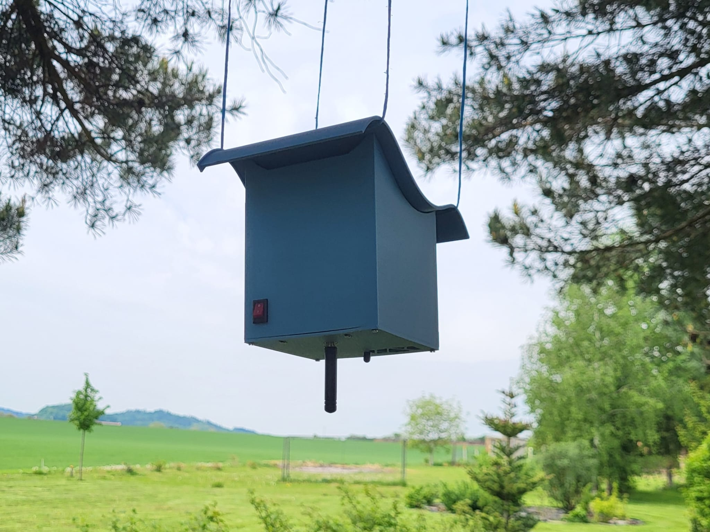

# Fire Detector

In this project, we developed and tested a prototype of a forest fire detector designed for deployment in high-risk forest areas (such as near frequently visited hiking trails, campsites, and fire pits).
The detection system consists of several strategically placed measurement modules (end nodes) and a central unit that receives the collected data and transmits it via a mobile network to a server for further processing and possible alarm activation. Communication between the end nodes and the central unit is implemented using LoRa radio technology.
For estimating the fire probability, we trained a small neural network.

## Hardware Components

**End Node**
- Nucleo STM32L073RZ
- LoRa SX1272 Mbed Enabled Shield
- Flame sensor DFR0076
- Smoke sensor SEN0570
- CO sensor MQ7
- Li-Ion battery 11.1 V / 28.5 Wh

**Central Node**
- Nucleo STM32L073RZ
- LoRa SX1272
- GSM module Mikroe GSM 2 Click
- Li-Pol battery 14.8 V / 22.4 Wh

## Links
- [Propagation video (in Czech)](https://www.youtube.com/shorts/PUgJaB7o2DU)
- [Final report (in Czech)](Detektor_požáru.pdf)